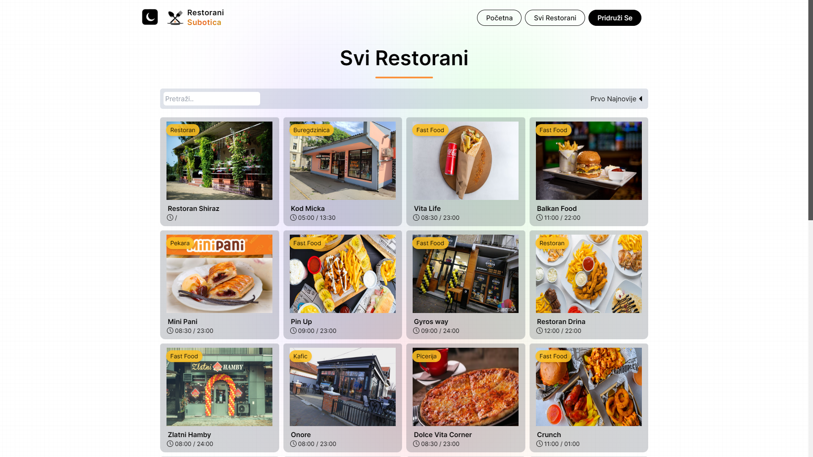
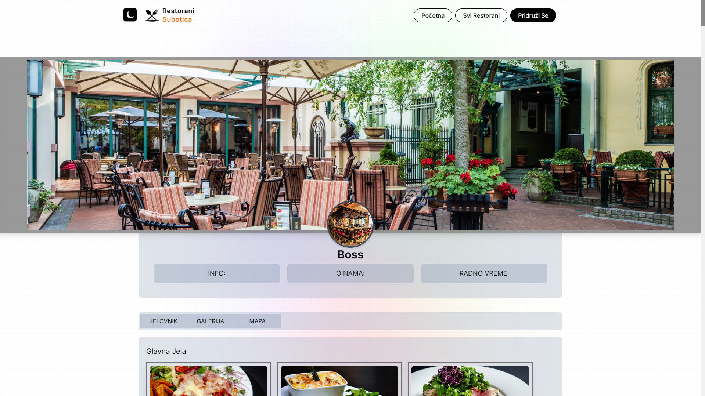

# Restorani Subotica


<p align="center">
  
  
 
</p>

Restorani Subotica is a web platform showcasing various restaurants in Subotica. Users can browse through a curated list of restaurants, view detailed information about each one, and make reservations directly through the website.

## Features

- **Restaurant Listings**: Browse a comprehensive list of restaurants in Subotica.
- **Search and Filter**: Easily search and filter restaurants by various criteria such as cuisine, location, and rating.
- **Restaurant Details**: View detailed information about each restaurant, including address, contact info and menu.
- **Order**: Make orders directly through the website.(This works only on phone)


## Technologies Used

- React
- NextJs
- TailwindCSS

## Installation

1. Clone the repository:
    ```sh
    git clone https://github.com/CojaDev/Restorani_Subotica2.git
    ```

2. Navigate to the project directory:
    ```sh
    cd Restorani_Subotica2
    ```

3. Install the dependencies:
    ```sh
    npm install
    ```

4. Run the development server:
    ```sh
    npm run dev
    ```

5. Open your browser and visit `http://localhost:3000` to view the website.

## Usage

1. Browse the list of restaurants and use the search and filter options to find your desired restaurant.
2. View detailed information about each restaurant.
3. Make a order directly through the website.


## Contributing

If you would like to contribute to this project, please fork the repository and submit a pull request.

## License

This project is licensed under the MIT License. See the [LICENSE](LICENSE) file for details.

## Contact

If you have any questions or suggestions, feel free to contact me at [amarcetic04@gmail.com](mailto:amarcetic04@gmail.com).
